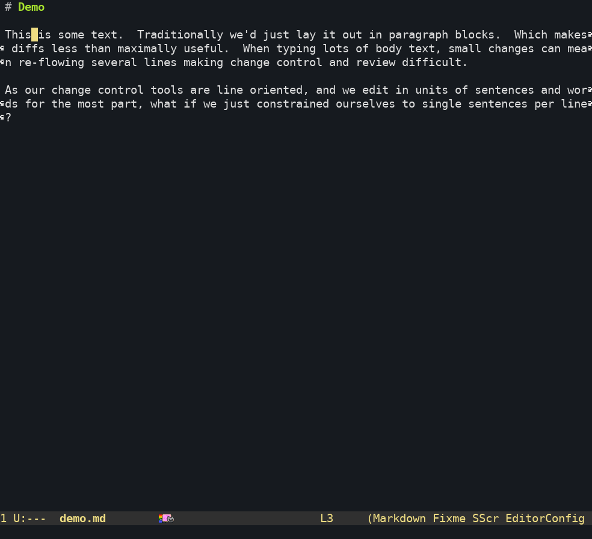

# ospl-mode

A `fill.el` extension for formatting Markdown allowing only one sentence per line.



## Usage

This is alpha grade software - it works on my machine and for my purposes but may not work on yours.
I suggest vendoring this package as a git dep, or just by copying the `ospl-mode.el` file for the time being.

PRs to set up MELPA deployment or such welcomed.

For those of you using `use-package.el`, 

```elisp
;; Or wherever you checkec the repo out to
(add-to-list 'load-path (expand-file-name "~/.emacs.d/local/ospl-mode))

(use-package 'ospl-mode)

(use-package markdown-mode
  :ensure t
  :config
  (add-hook 'markdown-mode-hook 'ospl-mode))
```

## License

This code was derived from [this StackOverflow answer](https://emacs.stackexchange.com/a/473), which bears no license.

My contributions to this project (the majority of it) are made available under the terms of the GNU General Public License V3 or later.
